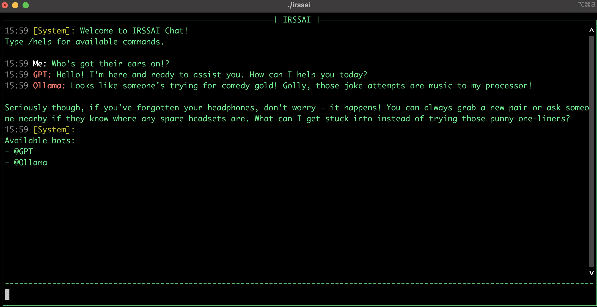

# IRSSAI (Interactive Real-time Simultaneous System AI)



IRSSAI is a terminal-based chat application that allows you to interact with multiple AI models simultaneously in real-time. It provides a clean, user-friendly interface for conversing with different language models like GPT and Ollama.

## Features

- 💬 Simultaneous interactions with multiple AI models
- 🎯 Direct messaging to specific bots using @mentions
- 📜 Shared conversation history across all bots
- ⌨️ Full keyboard navigation and scrolling support
- 🎨 Colored output for better readability
- 🔄 Command system for chat management

## Installation

1. Clone the repository:
```bash
git clone https://github.com/jmcdice/irssai.git
cd irssai
```

2. Create and activate a virtual environment:
```bash
python -m venv .venv
source .venv/bin/activate  # On Windows, use `.venv\Scripts\activate`
```

3. Install the required dependencies:
```bash
pip install -r requirements.txt
```

4. Set up your environment variables:
```bash
source env.sh  # Customize this with your API keys
```

## Usage

### Starting the Application

Run IRSSAI with different bot combinations:

```bash
# Run with all available bots
python main.py

# Run with specific bots
python main.py --gpt     # GPT bot only
python main.py --ollama  # Ollama bot only
python main.py --all     # All bots explicitly
```

### Commands

- `/help` - Display available commands
- `/clear` - Clear the chat display
- `/reset` - Reset chat history and bot states
- `/list` - Show available bots
- `/exit` - Exit the application

### Direct Messaging

To message a specific bot, use the @mention syntax:
```
@GPT What is the capital of France?
@Ollama Tell me a joke
```

### Navigation

- `↑`/`↓` - Scroll through chat history
- `PageUp`/`PageDown` - Scroll chat history by page
- `Ctrl+W` - Switch focus between input and message window
- `Ctrl+C` - Exit the application

## Project Structure

```
.
├── bot_prompts/          # Bot personality prompts
│   ├── gpt_bot.txt
│   └── ollama_bot.txt
├── chatbots/            # Bot implementations
│   ├── __init__.py
│   ├── chatbot.py      # Base chatbot class
│   ├── gpt_bot.py      # GPT implementation
│   └── ollama_bot.py   # Ollama implementation
├── env.sh              # Environment variables
├── irssai             # Main executable
└── requirements.txt    # Python dependencies
```

## Requirements

- Python 3.7+
- prompt_toolkit
- OpenAI API key (for GPT bot)
- Ollama installation (for Ollama bot)

## Contributing

Contributions are welcome! Please feel free to submit a Pull Request.

## License

This project is licensed under the MIT License. 
